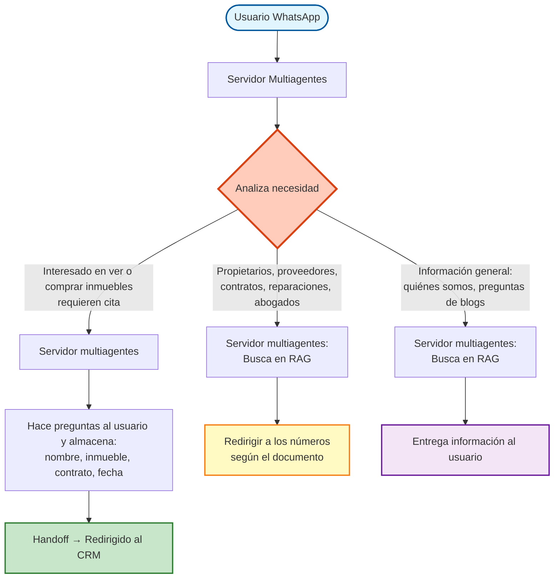

# NUEVO FLUJO: ARQUITECTURA RAG-FIRST CON TRIPLE ROUTING

**Fecha:** 2025-10-03
**Versión:** 1.0
**Estado:** Propuesta para Implementación

---

## 1. DIAGRAMA DE FLUJO GENERAL



---

## 2. ARQUITECTURA RAG-FIRST DETALLADA

```
┌─────────────────────────────────────────────────────────────────────────────┐
│                         USUARIO (WhatsApp)                                  │
│                 Mensaje: "Busco apartamento en Medellín"                    │
└───────────────────────────────┬─────────────────────────────────────────────┘
                                ↓
┌─────────────────────────────────────────────────────────────────────────────┐
│                   ORCHESTRATOR (Agent Selector)                             │
│                                                                             │
│   agent_priority = ["SupportAgent", "ReceptionAgent", "LeadsalesAgent"]   │
│                                                                             │
│   Función: _select_agent()                                                 │
│   ├─ Loop through agents                                                   │
│   ├─ SupportAgent.can_handle(state="NUEVO") → TRUE                        │
│   └─ Selected: SupportAgent                                                │
└───────────────────────────────┬─────────────────────────────────────────────┘
                                ↓
┌─────────────────────────────────────────────────────────────────────────────┐
│                          SUPPORT AGENT                                      │
│                   (RAG-Powered Decision Maker)                              │
│                                                                             │
│   ┌──────────────────────────────────────────────────────────────────┐    │
│   │  PASO 1: LLM Classification (_classify_user_intent)              │    │
│   │                                                                   │    │
│   │  Prompt: CLASSIFY_TRIPATH_INTENT                                 │    │
│   │  Input: "Busco apartamento en Medellín"                          │    │
│   │                                                                   │    │
│   │  Output:                                                          │    │
│   │  {                                                                │    │
│   │    "intent": "inmueble",           // inmueble|departamento|general│    │
│   │    "confidence": 0.92,                                            │    │
│   │    "entities": {                                                  │    │
│   │      "property_type": "apartamento",                              │    │
│   │      "location": "Medellín",                                      │    │
│   │      "action": "arrendar"                                         │    │
│   │    },                                                             │    │
│   │    "reasoning": "Usuario busca propiedad específica"              │    │
│   │  }                                                                │    │
│   └─────────────────────────────┬─────────────────────────────────────┘    │
│                                 ↓                                           │
│   ┌──────────────────────────────────────────────────────────────────┐    │
│   │  PASO 2: RAG SEARCH (OBLIGATORIO - _search_rag_for_routing)      │    │
│   │                                                                   │    │
│   │  Query enriquecido: "Busco apartamento Medellín proceso cita"    │    │
│   │                                                                   │    │
│   │  RAGService.search()                                              │    │
│   │  ├─ Embedding del query                                           │    │
│   │  ├─ Búsqueda vectorial FAISS (top_k=8)                           │    │
│   │  ├─ Scoring de relevancia                                         │    │
│   │  └─ Extract context                                               │    │
│   │                                                                   │    │
│   │  Documentos encontrados:                                          │    │
│   │  [0] "Procedimiento_Citas.pdf" (similarity: 2.1)                 │    │
│   │      → "Para agendar cita requiere documento..."                 │    │
│   │  [1] "Requisitos_Arriendo.pdf" (similarity: 3.5)                 │    │
│   │      → "Contrato arriendo desde 6 meses..."                      │    │
│   │  [2] "Politicas_Visitas.pdf" (similarity: 4.2)                   │    │
│   │                                                                   │    │
│   │  Phone extraction: regex search in docs                           │    │
│   │  ├─ No phones found (inmueble case)                               │    │
│   │  └─ rag_confidence: 0.85                                          │    │
│   └─────────────────────────────┬─────────────────────────────────────┘    │
│                                 ↓                                           │
│   ┌──────────────────────────────────────────────────────────────────┐    │
│   │  PASO 3: DECISION ROUTING (_determine_routing_path)              │    │
│   │                                                                   │    │
│   │  Intent: "inmueble"                                               │    │
│   │  RAG confidence: 0.85                                             │    │
│   │  Has phones: False                                                │    │
│   │                                                                   │    │
│   │  Decision Tree:                                                   │    │
│   │  ├─ IF intent == "inmueble" → CAMINO_1_INMUEBLE                 │    │
│   │  ├─ ELIF intent == "departamento" + has_phones → CAMINO_2_DEPT  │    │
│   │  └─ ELSE → CAMINO_3_GENERAL                                      │    │
│   │                                                                   │    │
│   │  Selected: CAMINO_1_INMUEBLE                                     │    │
│   └─────────────────────────────┬─────────────────────────────────────┘    │
│                                 ↓                                           │
│   ┌──────────────────────────────────────────────────────────────────┐    │
│   │  PASO 4: EXECUTE ROUTING                                         │    │
│   │                                                                   │    │
│   │  ╔════════════════════════════════════════════════════════╗      │    │
│   │  ║ CAMINO 1: INMUEBLE (Cita)                             ║      │    │
│   │  ╠════════════════════════════════════════════════════════╣      │    │
│   │  ║ Contexto RAG: Procedimiento citas                     ║      │    │
│   │  ║ Acción: Transfer → ReceptionAgent                     ║      │    │
│   │  ║                                                        ║      │    │
│   │  ║ Response Generator:                                   ║      │    │
│   │  ║ - LLM con contexto RAG                                ║      │    │
│   │  ║ - Mensaje personalizado                               ║      │    │
│   │  ║                                                        ║      │    │
│   │  ║ Output:                                               ║      │    │
│   │  ║ "¡Perfecto! Para agendar tu cita de visita           ║      │    │
│   │  ║  necesitamos algunos datos. Te haré unas              ║      │    │
│   │  ║  preguntas rápidas..."                                ║      │    │
│   │  ║                                                        ║      │    │
│   │  ║ Transfer metadata:                                    ║      │    │
│   │  ║ {                                                     ║      │    │
│   │  ║   "to_agent": "ReceptionAgent",                      ║      │    │
│   │  ║   "intent": "inmueble",                              ║      │    │
│   │  ║   "rag_context_used": true,                          ║      │    │
│   │  ║   "entities": {...}                                  ║      │    │
│   │  ║ }                                                     ║      │    │
│   │  ╚════════════════════════════════════════════════════════╝      │    │
│   │                                                                   │    │
│   │  ╔════════════════════════════════════════════════════════╗      │    │
│   │  ║ CAMINO 2: DEPARTAMENTOS                               ║      │    │
│   │  ╠════════════════════════════════════════════════════════╣      │    │
│   │  ║ Contexto RAG: Números contacto docs                   ║      │    │
│   │  ║ Acción: Extract números → Response                    ║      │    │
│   │  ║                                                        ║      │    │
│   │  ║ Departamentos:                                        ║      │    │
│   │  ║ - Propietarios                                        ║      │    │
│   │  ║ - Proveedores                                         ║      │    │
│   │  ║ - Contratos                                           ║      │    │
│   │  ║ - Reparaciones                                        ║      │    │
│   │  ║ - Abogados                                            ║      │    │
│   │  ║                                                        ║      │    │
│   │  ║ Phone Extractor:                                      ║      │    │
│   │  ║ - Regex: \d{3}\s?\d{3}\s?\d{4}                       ║      │    │
│   │  ║ - Parse from RAG docs                                 ║      │    │
│   │  ║                                                        ║      │    │
│   │  ║ Output:                                               ║      │    │
│   │  ║ "Para reparaciones, comunícate con:                  ║      │    │
│   │  ║  📞 324 551 XXXX (Mantenimiento)"                    ║      │    │
│   │  ║                                                        ║      │    │
│   │  ║ Estado: TRANSFERIDO (handoff humano)                 ║      │    │
│   │  ╚════════════════════════════════════════════════════════╝      │    │
│   │                                                                   │    │
│   │  ╔════════════════════════════════════════════════════════╗      │    │
│   │  ║ CAMINO 3: INFORMACIÓN GENERAL                         ║      │    │
│   │  ╠════════════════════════════════════════════════════════╣      │    │
│   │  ║ Contexto RAG: Blogs, quiénes somos, políticas        ║      │    │
│   │  ║ Acción: Generate response → User                     ║      │    │
│   │  ║                                                        ║      │    │
│   │  ║ Response Generator:                                   ║      │    │
│   │  ║ - LLM con documentos RAG                              ║      │    │
│   │  ║ - Respuesta contextualizada                           ║      │    │
│   │  ║                                                        ║      │    │
│   │  ║ Output:                                               ║      │    │
│   │  ║ "Somos Inmobiliaria Proteger, una empresa...         ║      │    │
│   │  ║  [Información extraída de RAG docs]"                  ║      │    │
│   │  ║                                                        ║      │    │
│   │  ║ Estado: Mantiene estado actual                        ║      │    │
│   │  ╚════════════════════════════════════════════════════════╝      │    │
│   └───────────────────────────────────────────────────────────────────┘    │
└───────────────────────────────┬─────────────────────────────────────────────┘
                                ↓
                ┌───────────────┼───────────────┐
                │               │               │
                ↓               ↓               ↓
    ┌────────────────┐  ┌──────────────┐  ┌──────────────┐
    │ RECEPTION      │  │ RAG          │  │ RAG          │
    │ AGENT          │  │ RESPONSE     │  │ EXTRACT      │
    │                │  │ GENERATOR    │  │ NUMBERS      │
    │ Captura:       │  │              │  │              │
    │ - Nombre       │  │ LLM Context: │  │ Parser:      │
    │ - Inmueble     │  │ RAG docs     │  │ Regex phone  │
    │ - Contrato     │  │              │  │ from docs    │
    │ - Fecha        │  │ Output:      │  │              │
    │                │  │ Respuesta    │  │ Output:      │
    │ Transfer:      │  │ natural      │  │ Números      │
    │ LeadsalesAgent │  │              │  │ + TRANSFERIDO│
    └────────┬───────┘  └──────────────┘  └──────────────┘
             ↓
    ┌────────────────────────────────────────┐
    │ LEADSALES AGENT                        │
    │                                        │
    │ - Crear lead CRM                       │
    │ - Handoff Protocol                     │
    │ - Estado: TRANSFERIDO (humano)         │
    └────────────────────────────────────────┘
```

---

## 3. FLUJO DE DATOS PASO A PASO

### Ejemplo 1: Búsqueda de Inmueble

```
┌──────────────────────────────────────────────────────────────────────┐
│ PASO 0: Usuario envía mensaje                                       │
├──────────────────────────────────────────────────────────────────────┤
│ Usuario: "Busco apartamento en Medellín"                            │
│ WhatsApp ID: 573001234567                                            │
│ Estado conversación: NUEVO                                           │
└────────────────────────────┬─────────────────────────────────────────┘
                             ↓
┌──────────────────────────────────────────────────────────────────────┐
│ PASO 1: Orchestrator selecciona agente                              │
├──────────────────────────────────────────────────────────────────────┤
│ orchestrator._select_agent()                                         │
│                                                                      │
│ Loop:                                                                │
│   ├─ SupportAgent.can_handle(state="NUEVO", msg=...)               │
│   │    ├─ Detecta keywords: "busco", "apartamento"                  │
│   │    ├─ is_off_topic = TRUE                                       │
│   │    └─ RETURN: TRUE ✅                                           │
│   │                                                                  │
│   └─ Selected: SupportAgent                                         │
│                                                                      │
│ Log: "[ORCHESTRATOR] Agente seleccionado: SupportAgent"             │
└────────────────────────────┬─────────────────────────────────────────┘
                             ↓
┌──────────────────────────────────────────────────────────────────────┐
│ PASO 2: SupportAgent.process_message()                              │
├──────────────────────────────────────────────────────────────────────┤
│ user_message = "Busco apartamento en Medellín"                      │
│ conversation = {state: "NUEVO", customer_name: null, ...}            │
│                                                                      │
│ Llamada: _classify_user_intent(user_message, conversation)          │
└────────────────────────────┬─────────────────────────────────────────┘
                             ↓
┌──────────────────────────────────────────────────────────────────────┐
│ PASO 3: Clasificación LLM                                           │
├──────────────────────────────────────────────────────────────────────┤
│ LLMService.classify_with_prompt(                                    │
│   message="Busco apartamento en Medellín",                          │
│   prompt=CLASSIFY_TRIPATH_INTENT,                                   │
│   context={state: "NUEVO"}                                           │
│ )                                                                    │
│                                                                      │
│ LLM Response (JSON):                                                 │
│ {                                                                    │
│   "intent": "inmueble",                                              │
│   "confidence": 0.92,                                                │
│   "sub_intent": "busqueda_propiedad",                               │
│   "entities": {                                                      │
│     "property_type": "apartamento",                                  │
│     "location": "Medellín",                                          │
│     "action": "arrendar",                                            │
│     "urgency": null                                                  │
│   },                                                                 │
│   "reasoning": "Usuario expresa búsqueda activa de propiedad"       │
│ }                                                                    │
│                                                                      │
│ Log: "[SupportAgent] Intent clasificado: inmueble (conf: 0.92)"     │
└────────────────────────────┬─────────────────────────────────────────┘
                             ↓
┌──────────────────────────────────────────────────────────────────────┐
│ PASO 4: RAG Search (OBLIGATORIO)                                    │
├──────────────────────────────────────────────────────────────────────┤
│ _search_rag_for_routing(                                            │
│   query="Busco apartamento en Medellín",                            │
│   intent="inmueble",                                                 │
│   entities={...}                                                     │
│ )                                                                    │
│                                                                      │
│ Query enriquecido:                                                   │
│ "Busco apartamento Medellín proceso cita visita requisitos"         │
│                                                                      │
│ RAGService.search(query, top_k=8)                                   │
│                                                                      │
│ Resultados:                                                          │
│ [0] doc_id: 42                                                       │
│     file: "Procedimiento_Citas.pdf"                                  │
│     similarity: 2.1 ⭐⭐⭐                                            │
│     content: "Para agendar cita de visita requiere documento        │
│               de identidad. Horarios: Lun-Vie 8-18h..."              │
│                                                                      │
│ [1] doc_id: 58                                                       │
│     file: "Requisitos_Arriendo.pdf"                                  │
│     similarity: 3.5 ⭐⭐                                              │
│     content: "Contrato arriendo desde 6 meses. Documentos:          │
│               cédula, certificado laboral..."                        │
│                                                                      │
│ [2] doc_id: 103                                                      │
│     file: "Politicas_Visitas.pdf"                                    │
│     similarity: 4.2 ⭐                                               │
│                                                                      │
│ Phone extraction (regex):                                            │
│   ├─ Pattern: r'\b\d{3}[\s-]?\d{3}[\s-]?\d{4}\b'                   │
│   ├─ Search in top 3 docs                                            │
│   └─ Found: [] (ninguno - es proceso de cita)                       │
│                                                                      │
│ RAG Context extracted:                                               │
│ "Para agendar cita de visita requiere documento de identidad.       │
│  Horarios: Lun-Vie 8-18h. Contrato arriendo desde 6 meses."         │
│                                                                      │
│ rag_confidence: 0.85                                                 │
│                                                                      │
│ Log: "[RAG] Búsqueda completada: 8 docs, top similarity: 2.1"       │
└────────────────────────────┬─────────────────────────────────────────┘
                             ↓
┌──────────────────────────────────────────────────────────────────────┐
│ PASO 5: Decision Routing                                            │
├──────────────────────────────────────────────────────────────────────┤
│ _determine_routing_path(                                            │
│   intent="inmueble",                                                 │
│   confidence=0.92,                                                   │
│   has_phones=False,                                                  │
│   rag_confidence=0.85                                                │
│ )                                                                    │
│                                                                      │
│ Decision Tree:                                                       │
│   IF intent == "inmueble" AND confidence > 0.7:                     │
│     → CAMINO_1_INMUEBLE ✅                                          │
│   ELIF intent == "departamento" AND has_phones:                     │
│     → CAMINO_2_DEPARTAMENTO                                         │
│   ELSE:                                                              │
│     → CAMINO_3_GENERAL                                              │
│                                                                      │
│ Selected Path: CAMINO_1_INMUEBLE                                    │
│                                                                      │
│ Log: "[SupportAgent] Routing: CAMINO_1_INMUEBLE"                    │
└────────────────────────────┬─────────────────────────────────────────┘
                             ↓
┌──────────────────────────────────────────────────────────────────────┐
│ PASO 6: Execute CAMINO_1_INMUEBLE                                   │
├──────────────────────────────────────────────────────────────────────┤
│ _handle_camino_1_inmueble(                                          │
│   rag_context="Para agendar cita requiere documento...",            │
│   entities={...}                                                     │
│ )                                                                    │
│                                                                      │
│ Generate response con LLM:                                           │
│   LLMService.generate_contextual_response(                          │
│     intent="transfer_to_reception",                                  │
│     rag_context="...",                                               │
│     entities={...}                                                   │
│   )                                                                  │
│                                                                      │
│ Response generado:                                                   │
│ "¡Perfecto! Para agendar tu cita de visita al apartamento          │
│  en Medellín, necesitamos algunos datos. Te haré unas               │
│  preguntas rápidas para coordinar todo. 📋"                         │
│                                                                      │
│ Metadata de transferencia:                                           │
│ {                                                                    │
│   "to_agent": "ReceptionAgent",                                      │
│   "intent": "inmueble",                                              │
│   "rag_context_used": true,                                          │
│   "entities": {                                                      │
│     "property_type": "apartamento",                                  │
│     "location": "Medellín"                                           │
│   },                                                                 │
│   "routing_confidence": 0.92                                         │
│ }                                                                    │
│                                                                      │
│ Return:                                                              │
│ {                                                                    │
│   "response": "¡Perfecto! Para agendar...",                         │
│   "transfer_to": "ReceptionAgent",                                   │
│   "data_updates": {                                                  │
│     "intent": "inmueble",                                            │
│     "support_classification": "inmueble",                            │
│     "rag_context": "..."                                             │
│   },                                                                 │
│   "transfer_metadata": {...}                                         │
│ }                                                                    │
└────────────────────────────┬─────────────────────────────────────────┘
                             ↓
┌──────────────────────────────────────────────────────────────────────┐
│ PASO 7: Orchestrator maneja transferencia                           │
├──────────────────────────────────────────────────────────────────────┤
│ send_message(sender_id, "¡Perfecto! Para agendar...")               │
│                                                                      │
│ _persist_transfer_metadata(                                         │
│   sender_id="573001234567",                                          │
│   target="ReceptionAgent",                                           │
│   metadata={...}                                                     │
│ )                                                                    │
│                                                                      │
│ DB Update:                                                           │
│   conversations.current_agent = "ReceptionAgent"                     │
│   conversations.transfer_metadata = {...}                            │
│   conversations.last_transfer_time = 1696345678.123                  │
│                                                                      │
│ Log: "[ORCHESTRATOR] Transfer preparado → ReceptionAgent"           │
└────────────────────────────┬─────────────────────────────────────────┘
                             ↓
┌──────────────────────────────────────────────────────────────────────┐
│ PASO 8: Usuario recibe respuesta                                    │
├──────────────────────────────────────────────────────────────────────┤
│ WhatsApp → 573001234567                                              │
│                                                                      │
│ Mensaje:                                                             │
│ "¡Perfecto! Para agendar tu cita de visita al apartamento          │
│  en Medellín, necesitamos algunos datos. Te haré unas               │
│  preguntas rápidas para coordinar todo. 📋"                         │
│                                                                      │
│ Estado interno:                                                      │
│   current_agent: ReceptionAgent (para próximo mensaje)              │
│   state: NUEVO (ReceptionAgent cambiará a POLITICAS_PRESENTADAS)    │
└────────────────────────────┬─────────────────────────────────────────┘
                             ↓
┌──────────────────────────────────────────────────────────────────────┐
│ PASO 9: Usuario responde (siguiente mensaje)                        │
├──────────────────────────────────────────────────────────────────────┤
│ Usuario: "Ok, cuéntame"                                              │
│                                                                      │
│ Orchestrator:                                                        │
│   ├─ conversation.current_agent = "ReceptionAgent"                  │
│   ├─ ReceptionAgent.can_handle(state="NUEVO") → TRUE                │
│   └─ Selected: ReceptionAgent ✅                                    │
│                                                                      │
│ ReceptionAgent inicia flujo obligatorio de captura:                  │
│   → Presenta políticas                                               │
│   → Captura nombre                                                   │
│   → Captura detalles inmueble                                        │
│   → Captura fecha necesidad                                          │
│   → Transfer a LeadsalesAgent (CRM)                                  │
└──────────────────────────────────────────────────────────────────────┘
```

---

### Ejemplo 2: Consulta de Departamento (Reparaciones)

```
┌──────────────────────────────────────────────────────────────────────┐
│ Usuario: "Necesito reportar una gotera en mi apartamento"           │
│ Estado: FLUJO_COMPLETADO                                             │
└────────────────────────────┬─────────────────────────────────────────┘
                             ↓
┌──────────────────────────────────────────────────────────────────────┐
│ Orchestrator → SupportAgent (can_handle FLUJO_COMPLETADO)           │
└────────────────────────────┬─────────────────────────────────────────┘
                             ↓
┌──────────────────────────────────────────────────────────────────────┐
│ LLM Classification:                                                  │
│ {                                                                    │
│   "intent": "departamento",                                          │
│   "confidence": 0.88,                                                │
│   "sub_intent": "reparaciones",                                      │
│   "entities": {                                                      │
│     "department": "reparaciones",                                    │
│     "urgency": "alta",                                               │
│     "issue_type": "gotera"                                           │
│   }                                                                  │
│ }                                                                    │
└────────────────────────────┬─────────────────────────────────────────┘
                             ↓
┌──────────────────────────────────────────────────────────────────────┐
│ RAG Search:                                                          │
│ Query: "reparaciones gotera apartamento contacto"                    │
│                                                                      │
│ Top docs:                                                            │
│ [0] "Contacto_Reparaciones.pdf"                                      │
│     "Para reparaciones urgentes: 324 551 8899 (Mantenimiento)"      │
│     Phone extracted: ["324 551 8899"] ✅                            │
│                                                                      │
│ [1] "Protocolo_Emergencias.pdf"                                      │
│     "Goteras: contactar inmediato al 300 123 4567"                   │
│     Phone extracted: ["300 123 4567"] ✅                            │
└────────────────────────────┬─────────────────────────────────────────┘
                             ↓
┌──────────────────────────────────────────────────────────────────────┐
│ Decision: CAMINO_2_DEPARTAMENTO                                      │
│ (intent="departamento" + has_phones=True)                            │
└────────────────────────────┬─────────────────────────────────────────┘
                             ↓
┌──────────────────────────────────────────────────────────────────────┐
│ Response:                                                            │
│ "Entiendo que tienes una gotera urgente. Para reportarla,           │
│  comunícate directamente con nuestro equipo de mantenimiento:        │
│                                                                      │
│  📞 324 551 8899 (Reparaciones - Urgente)                           │
│  📞 300 123 4567 (Emergencias)                                       │
│                                                                      │
│  Horario: 24/7 para emergencias."                                    │
│                                                                      │
│ new_state: TRANSFERIDO (handoff a humano)                            │
│ data_updates: {department: "reparaciones", phones_provided: true}    │
└──────────────────────────────────────────────────────────────────────┘
```

---

### Ejemplo 3: Información General

```
┌──────────────────────────────────────────────────────────────────────┐
│ Usuario: "Quiénes son ustedes?"                                      │
│ Estado: NUEVO                                                         │
└────────────────────────────┬─────────────────────────────────────────┘
                             ↓
┌──────────────────────────────────────────────────────────────────────┐
│ LLM Classification:                                                  │
│ {                                                                    │
│   "intent": "general",                                               │
│   "confidence": 0.95,                                                │
│   "sub_intent": "quienes_somos",                                     │
│   "entities": {}                                                     │
│ }                                                                    │
└────────────────────────────┬─────────────────────────────────────────┘
                             ↓
┌──────────────────────────────────────────────────────────────────────┐
│ RAG Search:                                                          │
│ Query: "quiénes somos empresa inmobiliaria historia"                 │
│                                                                      │
│ Top docs:                                                            │
│ [0] "Quienes_Somos.pdf" (similarity: 1.8)                           │
│ [1] "Blog_Historia_Empresa.pdf" (similarity: 3.2)                   │
│                                                                      │
│ Context:                                                             │
│ "Inmobiliaria Proteger es una empresa con 15 años de experiencia   │
│  en el mercado inmobiliario colombiano. Nos especializamos en       │
│  arriendo y venta de propiedades..."                                 │
└────────────────────────────┬─────────────────────────────────────────┘
                             ↓
┌──────────────────────────────────────────────────────────────────────┐
│ Decision: CAMINO_3_GENERAL                                           │
└────────────────────────────┬─────────────────────────────────────────┘
                             ↓
┌──────────────────────────────────────────────────────────────────────┐
│ LLM Response Generation:                                             │
│ (Con contexto RAG)                                                   │
│                                                                      │
│ Response:                                                            │
│ "¡Hola! Somos Inmobiliaria Proteger, una empresa con 15 años       │
│  de experiencia en el mercado inmobiliario colombiano.               │
│  Nos especializamos en arriendo y venta de propiedades,              │
│  brindando asesoría personalizada y segura. ¿En qué podemos          │
│  ayudarte hoy?"                                                      │
│                                                                      │
│ Estado: Mantiene NUEVO (no hay transferencia)                        │
└──────────────────────────────────────────────────────────────────────┘
```

---

## 4. MATRIZ DE DECISIONES

| Intent | Confidence | Has Phones | RAG Docs | → Camino | Acción Final |
|--------|-----------|-----------|----------|----------|--------------|
| `inmueble` | > 0.7 | No | Procedimiento Citas | **CAMINO 1** | Transfer → ReceptionAgent |
| `inmueble` | > 0.7 | Sí (error) | - | **CAMINO 1** | Transfer → ReceptionAgent |
| `departamento` (reparaciones) | > 0.7 | Sí | Contacto Reparaciones | **CAMINO 2** | Extrae números + TRANSFERIDO |
| `departamento` (pagos) | > 0.7 | Sí | Contacto Contabilidad | **CAMINO 2** | Extrae números + TRANSFERIDO |
| `departamento` (contratos) | > 0.7 | Sí | Contacto Contratos | **CAMINO 2** | Extrae números + TRANSFERIDO |
| `departamento` (abogados) | > 0.7 | Sí | Contacto Legal | **CAMINO 2** | Extrae números + TRANSFERIDO |
| `departamento` | > 0.7 | No | - | **CAMINO 3** | RAG response general |
| `general` (quiénes somos) | > 0.5 | No | Quienes_Somos.pdf | **CAMINO 3** | RAG response |
| `general` (horarios) | > 0.5 | No | Horarios.pdf | **CAMINO 3** | RAG response |
| `general` (blogs) | > 0.5 | No | Blog_*.pdf | **CAMINO 3** | RAG response |
| `unclear` | < 0.5 | - | - | **CAMINO 3** | Fallback message |

---

## 5. COMPONENTES TÉCNICOS

### 5.1 Nuevos Métodos en SupportAgent

```python
# app/agents/support_agent.py

async def _classify_user_intent(self, message, conversation):
    """Clasifica intención en: inmueble | departamento | general"""
    pass

async def _search_rag_for_routing(self, query, intent, entities):
    """Búsqueda RAG obligatoria para todos los caminos"""
    pass

def _determine_routing_path(self, intent, confidence, has_phones, rag_confidence):
    """Decide qué camino tomar (1, 2 o 3)"""
    pass

async def _handle_camino_1_inmueble(self, rag_context, entities):
    """Transfer a ReceptionAgent con contexto RAG"""
    pass

async def _handle_camino_2_departamento(self, rag_docs, phones, sub_intent):
    """Extrae números y genera mensaje de redirección"""
    pass

async def _handle_camino_3_general(self, rag_context, query):
    """Genera respuesta informativa con LLM + RAG"""
    pass
```

### 5.2 Nuevo Prompt LLM

```python
# app/prompts/classification_prompts.py

CLASSIFY_TRIPATH_INTENT = """
Clasifica la intención del usuario en UNA de estas 3 categorías:

1. **inmueble**: Usuario busca ver, comprar, arrendar propiedades
   - Requiere cita de visita
   - Ejemplos: "busco apartamento", "quiero comprar casa"

2. **departamento**: Usuario necesita contactar departamento específico
   - Departamentos: propietarios, proveedores, contratos, reparaciones, abogados
   - Ejemplos: "tengo una gotera", "cuándo pago", "necesito abogado"

3. **general**: Información general sobre la empresa
   - Ejemplos: "quiénes son", "horarios", "dónde quedan"

MENSAJE: {user_message}
CONTEXTO: {context}

Retorna JSON:
{
  "intent": "inmueble" | "departamento" | "general",
  "confidence": 0.0-1.0,
  "sub_intent": "reparaciones" | "pagos" | "quienes_somos" | etc,
  "entities": {...},
  "reasoning": "..."
}
"""
```

### 5.3 Extracción de Números de Teléfono

```python
import re

def extract_phones_from_text(text: str) -> list[str]:
    """
    Extrae números de teléfono colombianos de texto

    Formatos soportados:
    - 324 551 6105
    - 324-551-6105
    - 3245516105
    - +57 324 551 6105
    """
    pattern = r'\+?57?\s?\d{3}[\s-]?\d{3}[\s-]?\d{4}'
    phones = re.findall(pattern, text)
    return [phone.strip() for phone in phones]
```

---

## 6. BENEFICIOS DE ESTA ARQUITECTURA

### ✅ Ventajas

1. **RAG-First Approach**
   - Todas las decisiones informadas por documentos reales
   - Respuestas siempre contextualizadas
   - Números de contacto extraídos de docs oficiales

2. **Triple Routing Inteligente**
   - Inmuebles → Flujo completo de captación + CRM
   - Departamentos → Redirección directa (sin fricciones)
   - General → Respuestas inmediatas informativas

3. **Escalabilidad**
   - Agregar nuevos departamentos: solo actualizar RAG docs
   - Modificar flujos: cambios localizados
   - Sin hardcodear números de teléfono

4. **Experiencia de Usuario**
   - Respuestas rápidas a preguntas simples
   - No forzar flujo obligatorio para consultas informativas
   - Personalización con contexto RAG

5. **Mantenibilidad**
   - Single Source of Truth: RAG docs
   - Lógica clara y separada por caminos
   - Tests independientes por flujo

### ⚠️ Consideraciones

1. **Latencia RAG**
   - Búsqueda vectorial: ~200-500ms
   - Mitigación: Cache de queries frecuentes

2. **Calidad de Docs**
   - RAG solo es bueno si docs están actualizados
   - Requiere proceso de actualización documentos

3. **Fallbacks**
   - Si RAG no encuentra docs: usar fallback message
   - Si LLM timeout: clasificación por keywords

---

## 7. PRÓXIMOS PASOS

### Implementación Recomendada

**PR #3: RAG-First Triple Routing**

1. **Fase 1**: Implementar clasificación tripartita (1 día)
   - Nuevo prompt CLASSIFY_TRIPATH_INTENT
   - Método _classify_user_intent()
   - Tests unitarios

2. **Fase 2**: RAG Search obligatorio (1 día)
   - Método _search_rag_for_routing()
   - Extractor de números de teléfono
   - Tests con docs mock

3. **Fase 3**: Implementar 3 caminos (2 días)
   - _handle_camino_1_inmueble()
   - _handle_camino_2_departamento()
   - _handle_camino_3_general()
   - Tests de integración

4. **Fase 4**: E2E + Validación (1 día)
   - Tests E2E con 3 escenarios
   - Validación manual con chat_local.py
   - Ajustes de prompts

**Total estimado: 5 días**

---

## 8. VALIDACIÓN

### Checklist de Testing

- [ ] Usuario busca "apartamento" → Transfer a ReceptionAgent
- [ ] Usuario dice "tengo gotera" → Números de reparaciones extraídos
- [ ] Usuario pregunta "horarios" → RAG responde con info general
- [ ] Usuario dice "necesito abogado" → Números de legal extraídos
- [ ] RAG timeout → Fallback funciona
- [ ] LLM timeout → Keywords fallback funciona
- [ ] Docs sin números → Mensaje genérico correcto
- [ ] Flujo normal "Hola" → ReceptionAgent (sin interceptar)

---

**Documento generado:** 2025-10-03
**Versión:** 1.0
**Estado:** ✅ LISTO PARA REVISIÓN
